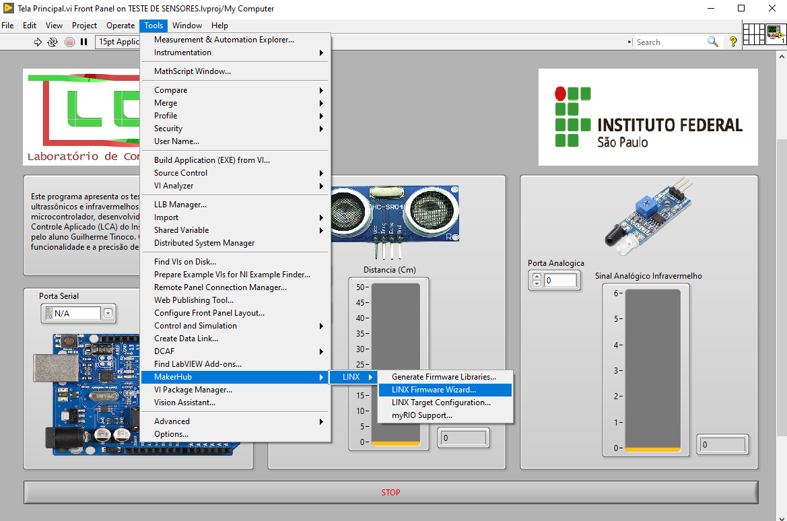
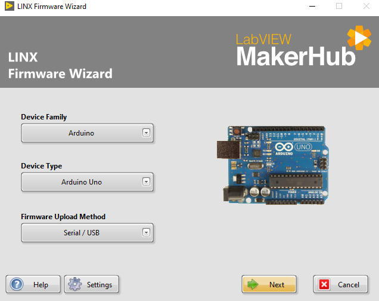
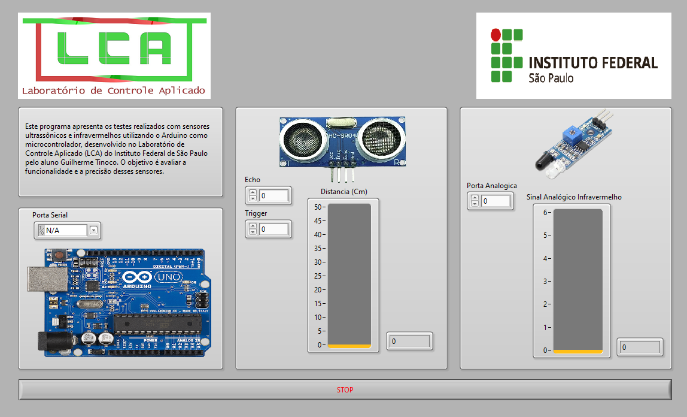

# LabVIEW-Testes-Arduino-IFSP
Os programas disponibilizados foram desenvolvidos para testes de dispositivos utilizados no projeto desenvolvido na disciplina de Introdução à Engenharia dos cursos de Engenharia de Controle e Automação e Engenharia Eletrônica do IFSP. Os programas desenvolvidos são destinados aos testes dos principais sensores e do sistema de acionamento dos motores utilizados num robô que segue linhas e evita choques com obstáculos. A ferramenta permite apresentar de maneira visual o funcionamento dos dispositivos por meio de gráficos, com uma integração simples com o microcontrolador Arduino.
# Nota:
Todo o código foi feito no LabVIEW 2018. O uso em versões inferiores pode apresentar problemas. Recomenda-se o uso do LabVIEW 2018 ou mais recente.
# Configurações iniciais:
Estas configurações são necessárias para qualquer um dos programas que utilizam arduinos, a primeira coisa é abrir o projeto e abrir a "Tela princiapal.vi".   

Após isso abra a aba tools, clique em makerhub, linx, e Firmware Wizard.

Ao abrir o wizard de instalação, escolha seu modelo de arduino, e clique em "Next".

Escolha a porta serial(usb) que seu arduino esta conectado e clique em "Next", após terminar clique em "Finalizar".

# Capturas de Tela
### Teste de sensores:

Antes de rodar o programa, selecione as portas de cada sensor e o usb do arduino, as portas dos sensores é apenas o número que esta o arduino não necessitando de nenhum outro digito (ex: A0  =  0).
### Controle Ponte H - Motores:

Para o programa do teste de motores, siga as instruções anteriores, sendo as entradas Pino Motor + ou - as portas IN1, IN2, IN3 e IN4 da ponte H, e o controle PWM + e - o controle de quanto ele gira para cada sentido (para mudar de direção é necessário zerar a outra)

